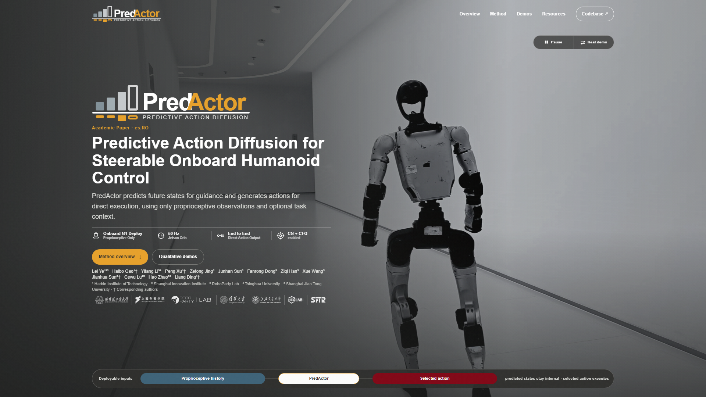

  <a href="https://masteryip.github.io/hoffman.github.io/">
    <picture>
      <source media="(prefers-color-scheme: dark)" srcset="docs/assets/predactor_on_dark.svg">
      <source media="(prefers-color-scheme: light)" srcset="docs/assets/predactor_on_white.svg">
      
    </picture>
  </a>

<h1 align="center">PredActor: Predictive Action Diffusion for Steerable Onboard Humanoid Control</h1>

  
  
  
  

  

> [!IMPORTANT]
> This repository currently provides the project overview and public demo links. Source code, trained checkpoints, and setup instructions are not available yet and will be added in a future release.

## Overview

**PredActor** augments action diffusion with an internal future-state trajectory for look-ahead guidance while retaining direct action execution. Within a joint state-action formulation, it predicts future states and actions from proprioceptive history and optional task context. Unlike a generator-tracker pipeline, predicted states remain inside the policy rather than becoming motion references for a separate tracker. Unlike action-only diffusion, the policy provides an explicit future-state trajectory for guidance.

This representation supports two complementary steering mechanisms: **classifier guidance (CG)** applies test-time objectives to predicted states, and **classifier-free guidance (CFG)** strengthens learned behavior conditions, including text commands. The selected action is sent directly to the joint controller; policy observations require only proprioception, not externally estimated full-body states.

For onboard execution, rolling denoising and computation-preserving runtime optimizations support **50 Hz control on a Unitree G1's Jetson Orin NX**. The measured complete callback takes **16.790 ms median and 19.383 ms p95**, both below the 20 ms control period. Across simulation and physical-robot evaluation, demonstrations cover text commands, disturbance response, joystick steering, and semantic interpolation.

## Project preview

  

### At a glance

- **Predictive direct control:** jointly predicts future states and actions, keeps states internal, and executes the selected action without a separate motion-reference tracker.
- **Proprioceptive inputs:** conditions on onboard proprioceptive history without requiring externally estimated full-body states as policy inputs.
- **CG and CFG steering:** combines test-time objectives on predicted states with learned behavior conditioning.
- **Rolling onboard inference:** reuses the denoising horizon across control ticks and optimizes runtime for 50 Hz operation on Jetson Orin NX.
- **Simulation and hardware evidence:** demonstrates commands, transitions, steering, and disturbance response.

## Demos

Click any preview to open the corresponding MP4 video. Videos are hosted by the public project website and are not duplicated in this repository.

  

<strong>Comprehensive simulation</strong> Text commands, joystick steering, external interference, and semantic interpolation in one sequence.

<table>
  <tr>
    <td width="50%" align="center">
       
      <strong>Hardware · Physical interaction</strong> 
      Walk and stand commands under external interference.
    </td>
    <td width="50%" align="center">
       
      <strong>Hardware · Text control</strong> 
      Walk, squat down, and return to walking.
    </td>
  </tr>
  <tr>
    <td width="50%" align="center">
       
      <strong>Hardware · Behavior transitions</strong> 
      Walk, accelerate to a jog, and transition into a squat.
    </td>
    <td width="50%" align="center">
       
      <strong>Simulation · Joystick steering</strong> 
      Directional steering with text-selected locomotion modes.
    </td>
  </tr>
</table>

## Resources

| Resource | Description |
| --- | --- |
| [Project website](https://masteryip.github.io/hoffman.github.io/) | Method overview, figures, authorship, and the complete demo gallery |
| [Public repository](https://github.com/MasterYip/HoffMan) | Official release channel for future code and model updates |
| [Demo collection](https://masteryip.github.io/hoffman.github.io/#evidence) | Simulation and hardware evidence in the browser |
| Paper and citation | Coming soon |

## Release status

The public release is being prepared. This README will be expanded with installation, model, data, and evaluation instructions when the implementation is ready. Please use the project website and this repository as the canonical public resources in the meantime.

## License

The contents of this repository are released under the [MIT License](LICENSE), unless noted otherwise.
