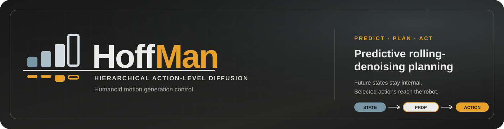

  

  <strong>Hierarchical Action-Level Diffusion for Humanoid Motion Generation Control</strong>

  
  
  
  

  
  
  
  
  
  
  

> [!IMPORTANT]
> This repository currently provides the project overview and public demo links. Source code, trained checkpoints, and setup instructions are not available yet and will be added in a future release.

## Overview

**HoffMan** is a hierarchical action-level diffusion framework for humanoid motion generation and control. Its predictive rolling-denoising planning process jointly models future robot states and actions from proprioceptive history and optional task context. Predicted states remain inside the planning process, while the selected action is sent directly to the robot.

The project studies a single control interface for text-conditioned motion, semantic interpolation, joystick steering, and reaction to physical interaction across simulation and hardware demonstrations.

## Project preview

  

Open the <a href="https://masteryip.github.io/hoffman.github.io/">project website</a> for the full method overview, figures, and interactive demo collection.

### At a glance

- **Predictive control:** jointly predicts future state and action trajectories.
- **Rolling denoising:** reuses the planning horizon across control ticks for online generation.
- **Direct action output:** executes a selected action without a separate motion-tracking handoff.
- **Flexible conditioning:** supports task context and optional state-space guidance.
- **Simulation and hardware:** demonstrates commands, transitions, steering, and physical interaction.

## Demos

Click any preview to open the corresponding MP4 video. Videos are hosted by the public project website and are not duplicated in this repository.

  

<strong>Comprehensive simulation</strong> Text commands, joystick steering, external interference, and semantic interpolation in one sequence.

<table>
  <tr>
    <td width="50%" align="center">
       
      <strong>Hardware · Physical interaction</strong> 
      Walk and stand commands under external interference.
    </td>
    <td width="50%" align="center">
       
      <strong>Hardware · Text control</strong> 
      Walk, squat down, and return to walking.
    </td>
  </tr>
  <tr>
    <td width="50%" align="center">
       
      <strong>Hardware · Behavior transitions</strong> 
      Walk, accelerate to a jog, and transition into a squat.
    </td>
    <td width="50%" align="center">
       
      <strong>Simulation · Joystick steering</strong> 
      Directional steering with text-selected locomotion modes.
    </td>
  </tr>
</table>

## Resources

| Resource | Description |
|---|---|
| [Project website](https://masteryip.github.io/hoffman.github.io/) | Method overview, figures, authorship, and the complete demo gallery |
| [Public repository](https://github.com/MasterYip/HoffMan) | Official release channel for future code and model updates |
| [Demo collection](https://masteryip.github.io/hoffman.github.io/#evidence) | Simulation and hardware evidence in the browser |
| Paper and citation | Coming soon |

## Release status

The public release is being prepared. This README will be expanded with installation, model, data, and evaluation instructions when the implementation is ready. Please use the project website and this repository as the canonical public resources in the meantime.

## License

The contents of this repository are released under the [MIT License](LICENSE), unless noted otherwise.
